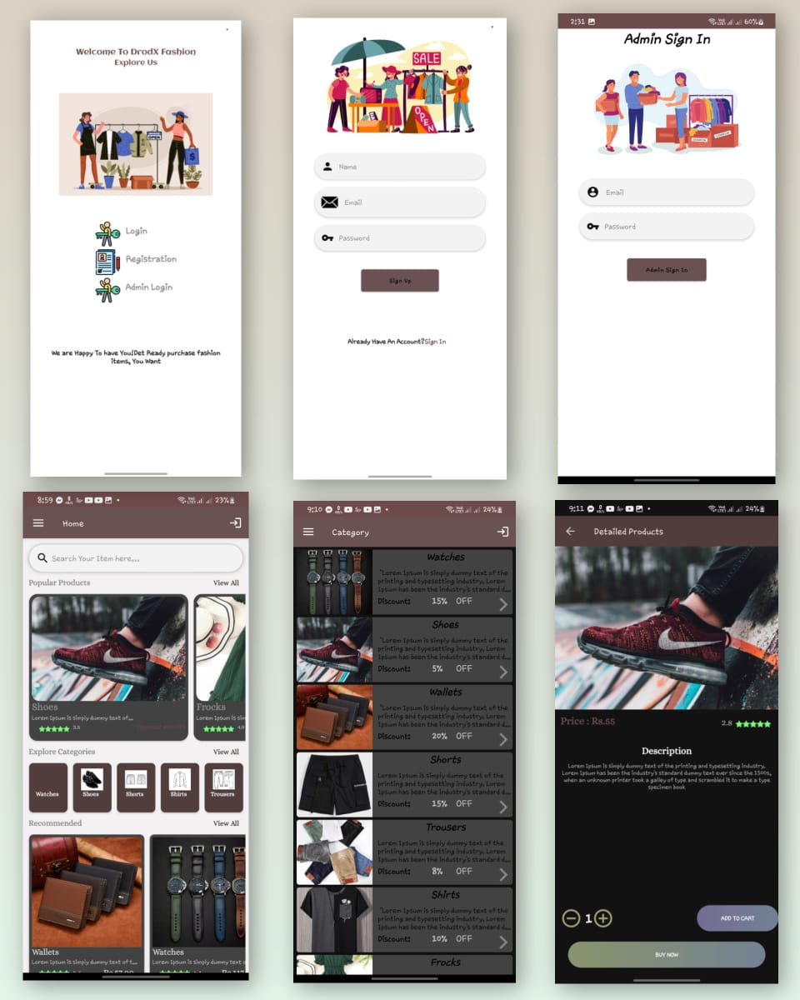
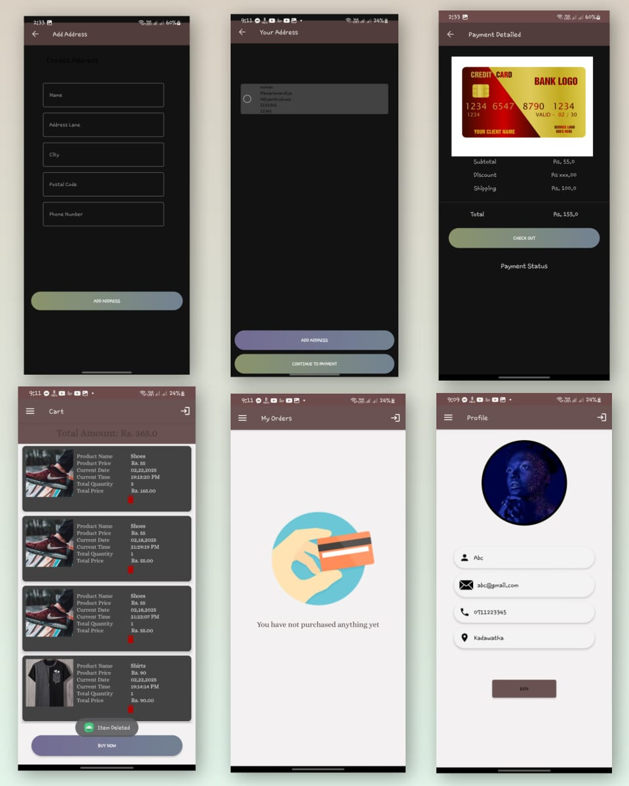
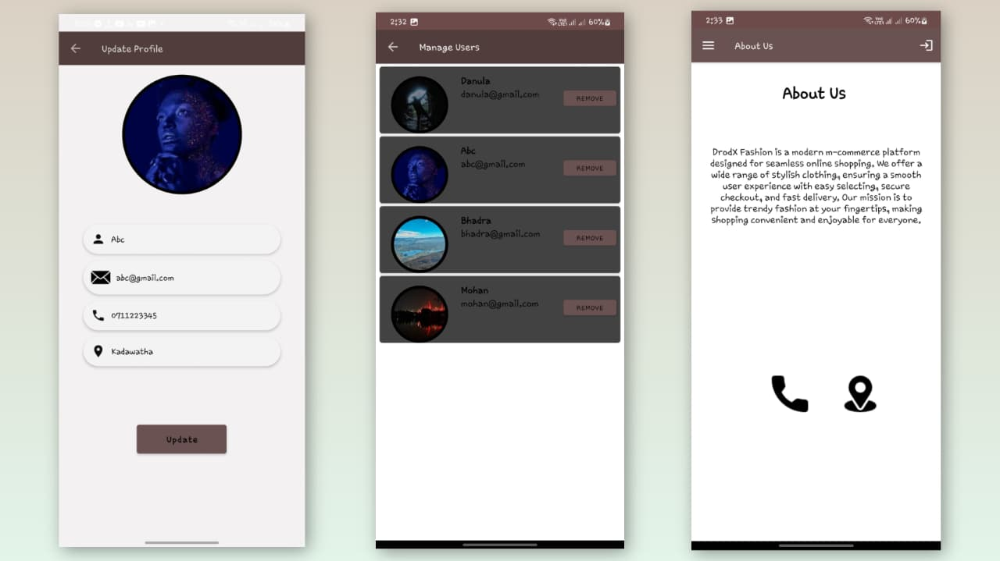

# DrodX Fashion Mobile App

The DrodX Fashion mobile application is a comprehensive **m-commerce solution** for fashion retail, enabling customers to browse, select, and purchase clothing and accessories directly from their mobile devices. The app emphasizes **user-friendly design**, **security**, and **scalability**, offering both **customer-facing features** and an **administrative panel** for efficient store management.

## Project Overview

### User Features

* **User Registration & Login:** Secure account creation and login via email/password.
* **Product Browsing:** View products by categories.
* **Search:** Search for products using keywords or filters.
* **Product Details:** Images, descriptions, pricing, sizes, and material information.
* **Shopping Cart:** Add, remove, or update items.
* **Secure Payment:** Integration with PayHere and other payment gateways.
* **Order Tracking:** Real-time tracking of order status.
* **Push Notifications:** Alerts for orders, promotions, and new arrivals.
* **Wishlist:** Save items for future purchases.
* **Customer Support:** Chat or email support.

### Admin Features

* **Customer Management:** View and manage user accounts.
* **Product Management:** Add, edit, and delete products.
* **Order Management:** Track and process orders.

---

**Objectives:**

* Provide a seamless and engaging shopping experience.
* Expand online presence and increase sales.
* Strengthen brand presence with a modern and responsive app.

**Scope of Work:**

* Functional Requirements: User registration, product browsing, search, cart management, secure payments, order tracking, wishlist, notifications, and customer support.
* Non-Functional Requirements: Security, performance, usability, and scalability.
* Design: Responsive design, brand consistency, and intuitive UX.
* Testing & QA: Functional, performance, security testing, and user acceptance testing.

## Technologies Used

* **Frontend:** Android Java (XML for UI)
* **Backend:** Firebase Authentication, Firestore, Realtime Database, Firebase Storage, Google Maps API
* **Database:** Firestore and SQLite
* **Payment Gateway:** PayHere
* **Development Tools:** Android Studio
* **Architecture:** Activity & Fragment structure (e.g., LoginActivity, MainActivity, ProductDetailActivity etc.)
* **Coding Standards:** OOPC concepts & OOD patterns

---
## Screenshots 

## 📸 Screenshots

### Main Page, Register Page, SignIn Page, Home Page, Category Page, Detailed-Product Page

### Add Address Page, Edit Address Page, Payment Details Page, Cart Page, My Orders Page, Profile Page,

### Update Profile Page, Manage-Users Page, Abount-Us Page

## License

This project is licensed under the **MIT License**. You are free to use, modify, and distribute the project, but please credit the original author.
